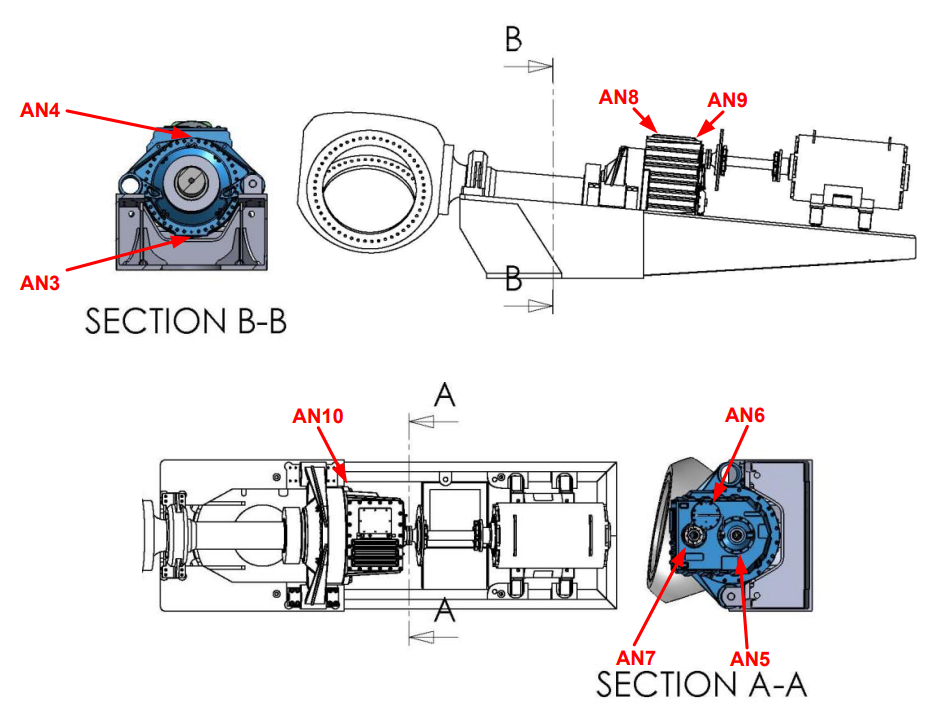
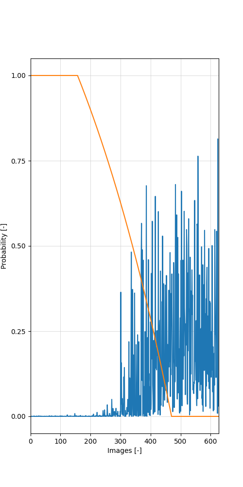
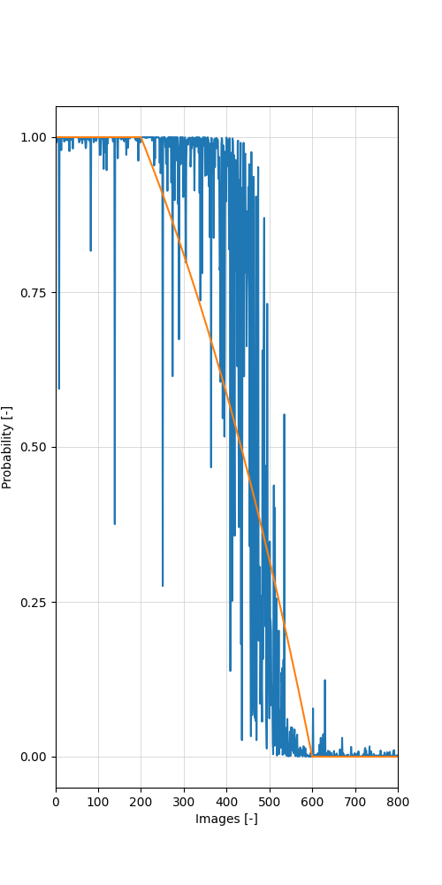

# (Digital) Appendix A and further data.
Appendix A: Additional Augmented Data Plots
In this virtual appendix additional plots with of the performance with augmented data for both FRED and AMED are
represented. This is to obtain a thorough overview of the performance of both models. The following plots do
not have additional noise added and will be similar to Figure 10. Figure 12 gives an overview on the placements
of all the sensors on the gearbox. Figure 13 shows the plots of FRED and AMED for sensor 3. Subsequently,
Figure 14 shows the plots for sensor 4, etc. 
<figure>
  
  <figcaption>Figure 12: An overview of the positions of the sensors on the wind turbine gearbox. In this image AN3-AN10
represent the location of sensor 3 to sensor 10. </figcaption>
</figure>
---
---
The following figures consist of the different data images

AMED Sensor 3 performance | FRED Sensor 3 performance
--- | ---
 | 
